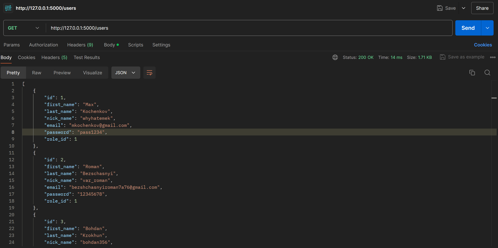
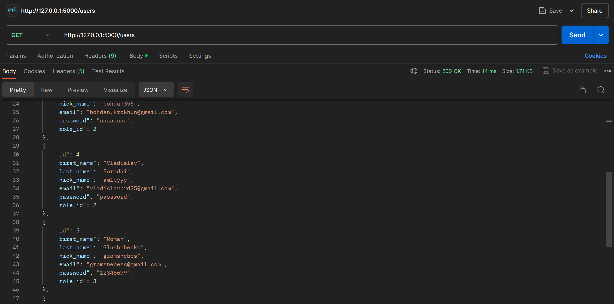
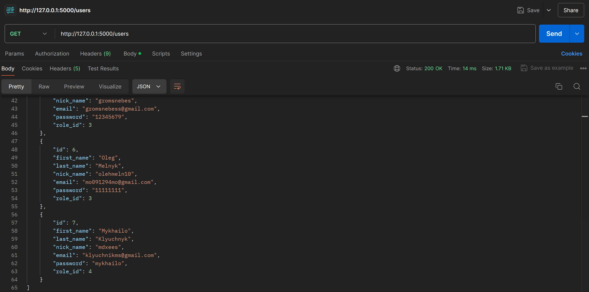
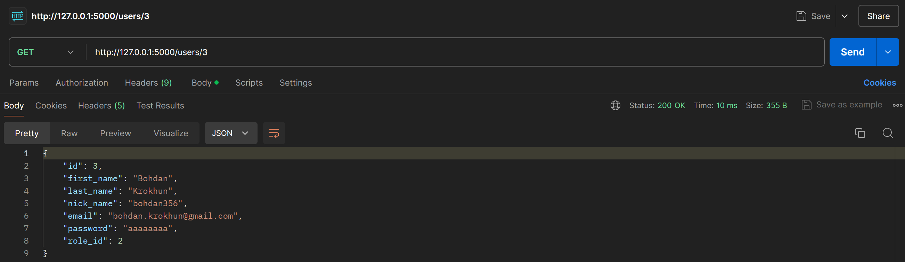
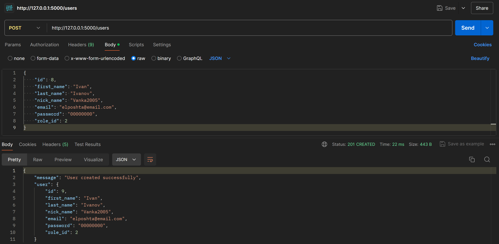
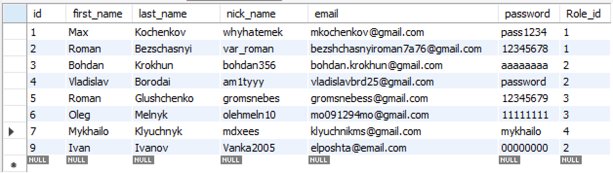
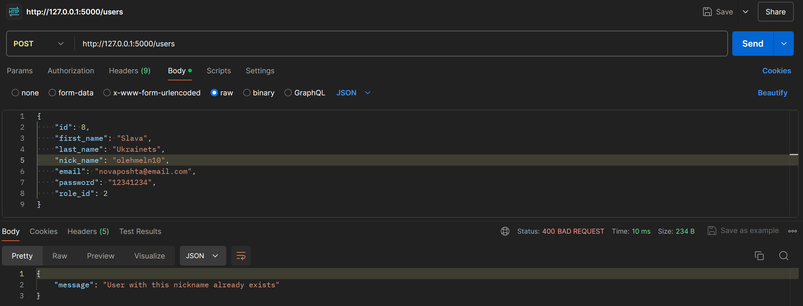
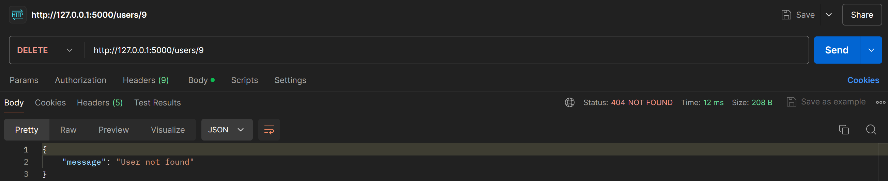
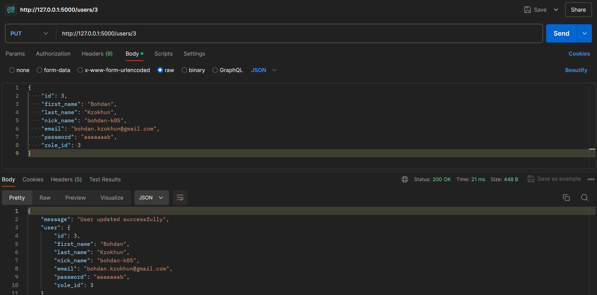
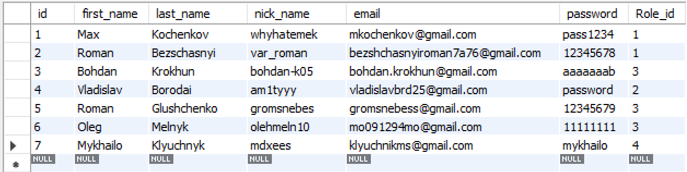

# Тестування працездатності системи

## Засоби тестування

Тестування CRUD застоснку виконується за допомогою онлайн-інструменту Postman. Для його роботи необхідно встановити Postman Agent.

### Отримання інформації про усіх користувачів

### Отримання інформації про певного користувача за його ID

### Успішне створення нового користувача

### Вміст таблиці "user" після створення нового користувача

### Помилка "Нікнейм зайнято" при спробі створити нового користувача

### Помилка "Електронну пошту зайнято" при спробі створити нового користувача

### Успішне видалення користувача

### Помилка "Користувача не знайдено" при спробі його видалити

### Оновлення інформації про користувача

### Вміст таблиці "user" після виконання усіх операцій

